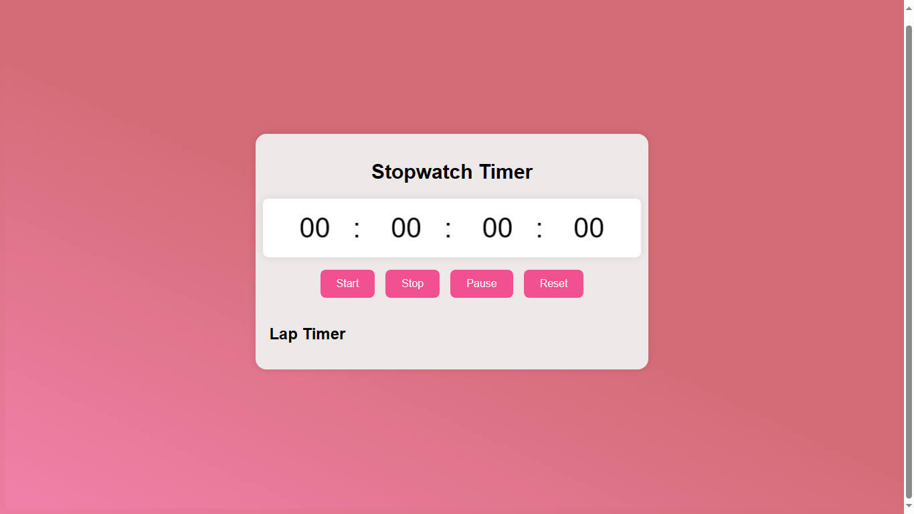

# Stopwatch Timer Application

This is a simple web-based Stopwatch Timer Application built with HTML, CSS, and JavaScript. It allows users to start, stop, pause, and reset a stopwatch timer. Additionally, it provides a feature to record lap times.

## Features

- Start, stop, pause, and reset the stopwatch timer.
- Record lap times while the timer is running.
- Display the timer with hours, minutes, seconds, and milliseconds.

## Technologies Used


## Screenshots

;
;

## How to Use

1. Clone the repository to your local machine:

   ```bash
   git clone https://github.com/your_username/stopwatch-timer.git
   ```

1. Open `index.html` in a web browser to view and interact with the application.
1. Click on the Start button to start the timer.
   1.Use the Stop button to stop the timer. You can also pause the timer with the Pause button and reset it with the Reset button.
1. To record lap times, click the Stop button while the timer is running.
